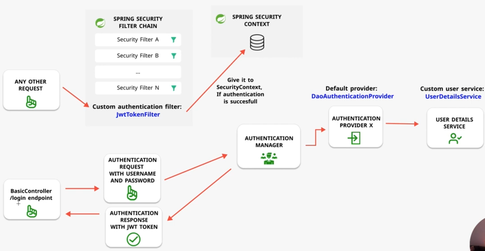

We will use jjwt in this demo, we will use nimbus-jose in future demo as jjwt is deprecated.

based on this tutorial [Spring Security: Authentication Architecture Explained in Depth](https://youtu.be/ElY3rjtukig)

But I changed a lot of code to reflect spring security 5.7 updates.

## Environment

- Java 17
- Spring Boot 2.7.4

## Checkpoint

- [x] Generate JWT Token in LoginController(POST /login)
- [x] Intercept(Use) JWT Bearer Token in JwtTokenFilter

## Checkpoint #1 Generate jwt token

We will use the following:

1. ~~built-in~~ Custom AuthenticationManager
2. built-in DaoAuthenticationProvider
3. custom UserDetailsService
4. Define our own JwtTokenFilter, add it before UsernamePasswordAuthenticationFilter

## Checkpoint #2 handle jwt bearer token in JwtTokenFilter

注意validate token或认证失败不必抛出异常， 让filterChain继续往下。。